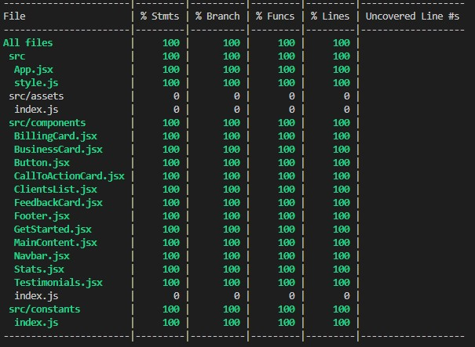

# Modern website using React.js and Tailwind CSS

The idea was to develop a modern UI/UX and responsive website to work deeply with CSS, and I decided to explore the Tailwind framework to execute this project 🤓

You can find the Figma design [here](https://www.figma.com/file/bUGIPys15E78w9bs1l4tgS/HooBank?node-id=310:485&t=Ov9O08lJ6FshYig3-1).

This project was bootstrapped with [Create React App](https://github.com/facebook/create-react-app).

## Available Scripts 

In the project directory, you can run:

#### `npm start`

It will run the app in development mode. Open [http://localhost:3000](http://localhost:3000) to view it in your browser.

#### `npm test`

Launches the test runner in the interactive watch mode and will show the coverage.

The tests were created using react [@testing-library](https://testing-library.com/docs/).

## Screenshots :camera:

